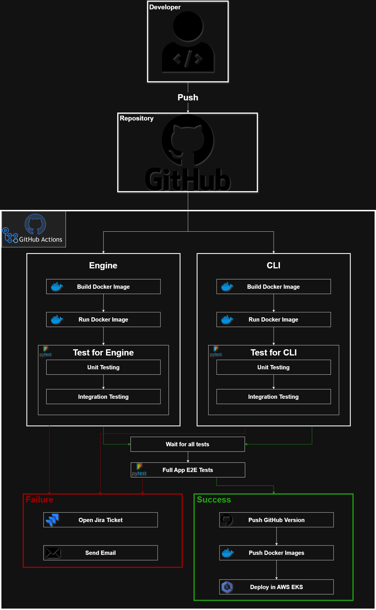

# SeyoAWE Community – Full DevOps Lifecycle & Automation Engine

## 🏗️ DevOps Architecture & Tech Stack

**Cloud Architecture:**


**CI/CD Architecture:**


**Deployment Workflow Architecture:**


* **Source Control:** GitHub
* **CI/CD Orchestration:** Jenkins
* **Containerization & Registry:** Docker & Docker Hub
* **Infrastructure as Code (IaC):** Terraform
* **Configuration Management:** Ansible
* **Container Orchestration:** Kubernetes (K8s)
* **Observability (Bonus):** Prometheus & Grafana

## 📂 DevOps Repository Structure
```text
.
├── engine/        # Automation engine source code
├── cli/           # CLI implementation source code
├── docker/        # Dockerfiles for Engine and CLI
├── k8s/           # Kubernetes manifests (StatefulSets, Services, PVCs)
├── terraform/     # Infrastructure provisioning scripts
├── ansible/       # Configuration playbooks for node setup
├── jenkins/       # Jenkinsfiles for CI/CD pipelines
├── monitoring/    # Prometheus & Grafana configuration (Bonus)
└── Scheme.png     # DevOps Architecture Diagram
```

## 🚀 CI/CD Pipeline Flow

This project utilizes a version-coupled, multi-pipeline approach to ensure efficient builds and deployments.

### 1. Continuous Integration (CI)
The CI process is split into two pipelines that share semantic versioning to avoid unnecessary rebuilds.
* **Engine Pipeline:** Triggers on changes to `engine/`. Runs linting, executes unit tests, builds the Docker image, tags it with semantic versioning, and pushes the artifact to Docker Hub.
* **CLI Pipeline:** Triggers on changes to `cli/`. Executes unit tests, packages the CLI tool, tags it with the shared semantic version, and publishes the artifact.

### 2. Continuous Deployment (CD)
Once the CI pipelines successfully publish the new artifacts, the CD pipeline handles the rollout:
1. **Provisioning:** Terraform provisions the necessary underlying infrastructure (e.g., VMs, networking).
2. **Configuration:** Ansible runs playbooks to configure the provisioned servers with required dependencies.
3. **Deployment:** Jenkins applies the updated Kubernetes manifests (`k8s/`) to the cluster. The Engine is deployed as a **StatefulSet** with persistent storage (PVCs) and configured health probes. 

## ⚙️ Setup and Operations

### Prerequisites
* Jenkins server with Docker, Terraform, and kubectl installed.
* Configured credentials in Jenkins for GitHub, Docker Hub, and your Cloud Provider.
* An active Kubernetes cluster.

### Deployment Steps
1. **Infrastructure:** Navigate to the `terraform/` directory and run `terraform init` and `terraform apply` to spin up the base infrastructure.
2. **Configuration:** Execute the Ansible playbooks in the `ansible/` directory against the newly provisioned IP addresses.
3. **Pipelines:** Import the Jenkinsfiles located in the `jenkins/` folder into your Jenkins server as Multibranch Pipelines.
4. **Monitor:** Access the Grafana dashboard via the configured Ingress/Service port to view system metrics.

## 📊 Observability (Bonus)
The Kubernetes cluster includes a deployed Prometheus instance that scrapes metrics from the Engine and Kubernetes nodes. Grafana is connected to Prometheus as a data source, providing visual dashboards and alerting for CPU, memory, and application-specific health metrics.

<br>

---
---

# ⬇️ ORIGINAL SEYOAWE PROJECT DOCUMENTATION ⬇️
*Note: The following section is the original, unmodified documentation from the base SeyoAWE repository.*

---
---

<br>

# ⚙️ SeyoAWE — Universal Workflow Automation Engine

**Version:** 1.0  
**Author:** Yuri Bernstein  
**License:** Dual (Community Edition | Commercial Edition)  
**Website:** [seyoawe.dev](https://seyoawe.dev) *(Coming soon)*

---

## 🚀 What is SeyoAWE?

**SeyoAWE** is a modular, GitOps-native, human-in-the-loop automation platform.  
Define powerful, reliable workflows in YAML — with built-in support for approvals, forms, Git, APIs, Slack, and more.

### 🔥 What Makes SeyoAWE Different

- **Modular by Design**: Each Python module is a clear, composable unit.
- **GitOps-Native**: Treat workflows as code. Push to Git. Trigger via webhook or poll.
- **Human-in-the-Loop**: Slack approvals, webforms, dynamic approval links, and chatbot interactions built-in.
- **Crash-Resilient**: Persistent state, resumable runs, and detailed logs.
- **Pluggable**: Add your own modules in minutes. APIs, scripts, workflows, or UIs.

---

## 📦 Quickstart

### ✅ Requirements

`eninge`: none

`sawectl`:
  `binary`: none
  `python script`:
    - Python 3.10+


### 🚀 Running SeyoAWE (Local Engine)

```bash
./run.sh linux   # or ./run.sh macos
```

This launches the Flask-powered SeyoAWE runtime at `http://localhost:8080`.

Your `configurations/config.yaml` should point to:
```yaml
directories:
  workdir: /path/to/seyoawe-execution-plane
  modules: /path/to/seyoawe/modules
  workflows: /path/to/seyoawe/workflows
```

---

## 🧬 Writing Your First Workflow

```bash
sawectl workflow init hello-world
```

Creates a scaffold in `workflows/hello-world.yaml`.

### 🧾 Example Workflow

```yaml
name: hello-world
trigger:
  type: ad-hoc

context_variables:
  name: "Yura"

steps:
  - id: greet
    module: slack
    config:
      message: "Hello, {{ context.name }}! Welcome to SeyoAWE."
```

### 💡 Run it

```bash
sawectl run workflows/hello-world.yaml
```

---

## 🧰 sawectl CLI

The official CLI tool to manage, validate, and run workflows.

### 🔑 Common Commands

```bash
sawectl run <path.yaml>             # Run ad-hoc workflow
sawectl validate-workflow <wf.yaml> # Deep schema + module validation
sawectl list-modules                # View installed modules
sawectl workflow init <name>        # Scaffold a new workflow
sawectl module create <name>        # Scaffold a custom module
```

---

## ⏰ Trigger System

| Trigger      | Description                                                            |
| ------------ | -----------------------------------------------------------------------|
| `api`        | Exposes an endpoint to receive and parse events                        |
| `git`        | Monitors Git repos (poll or webhook) for file changes                  |
| `scheduled`  | Uses cron syntax with for recurring workflows                          |
| `ad-hoc`     | Manually executed via CLI or UI                                        |

---

## 🧩 Modules

Modules are plug-and-play Python classes with full control.

### 📦 Built-In Modules

| Module     | Description                                         |
|------------|-----------------------------------------------------|
| `webform`  | React-based approval form renderer                  |
| `slack`    | Sends messages and links via Slack                  |
| `email`    | Sends rich email notifications or approval requests |
| `api`      | Makes dynamic REST API calls                        |
| `git`      | GitOps actions: branches, commits, PRs              |
| `chatbot`  | Interacts with users using LLMs (OpenAI, Mistral)   |

---

### 🧑‍🔧 Build Your Own Module

```bash
sawectl module create mymodule
```

Creates:
```plaintext
modules/mymodule/
  ├── module.yaml
  └── mymodule.py
```

Edit `module.yaml`:
```yaml
name: mymodule
entrypoint: mymodule.py
description: My custom module
```

Edit `mymodule.py`:
```python
class Module:
    def execute(self, input_data, context, **kwargs):
        # do something here
        return {'status': 'ok', 'message': 'Success'}
```

Modules return:
- `ok` → step succeeded
- `fail` → halts workflow
- `warn` → logs warning, proceeds

---

## 🧾 Webforms & Approvals

Any step can pause for human approval:

```yaml
approval: true
delivery_step:
  module: slack
  config:
    message: "Please approve: {{ context.approval_link }}"
```

You can also define rich webforms with structured input. The engine waits, collects the form data, and resumes with `context.form_data`.

---

## 🧠 Workflow Context

The engine maintains a context object across steps.

- Use `context` to inject dynamic values
- Update context between steps
- Access previous results via `context.step_id.output`

---

## 🐞 Logs & Recovery

Each run generates:

- A UUID
- A lifetime state JSON file
- A full per-run log

```bash
lifetimes/3f21fa2b-...json
logs/run_3f21fa2b-...log
```

Crash? Restart the engine — it will resume in-place.

---

## 🎯 Real-World Use Cases

✅ CI/CD with approvals  
✅ Slack & email alerting  
✅ Integration with any system or tool using generic `api` and `command` modules
✅ GitOps PR automation  
✅ Multi-step integrations with manual gates

Involve human review(s) at any stage !
---

## 📜 License

SeyoAWE is dual-licensed:

| Edition            | License       | Details                                                |
|--------------------|---------------|--------------------------------------------------------|
| **Community** | Custom        | Free to use internally. No resale or monetization.     |
| **Commercial** | Proprietary   | Adds DB, secrets, premium modules, premium support,    |
|                    |               | dashboards and reports and more.                       |

See [`LICENSE`](./LICENSE) for full details.

---

## 🙋 Get Involved

- 💡 Want to contribute a module? PR to `modules/`
- 🧪 Testing a module in a large org? Reach out for early access!
- 🧰 Using in a CI/CD pipeline? Tell us how it helped!

---

## 🏁 Final Word

SeyoAWE isn’t just another automation engine.

It’s a human-aware, Git-native, modular platform for teams who need infinitley flexible, yet simple automation solution

---
