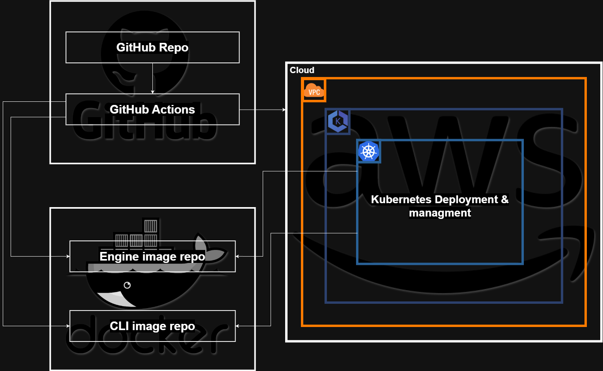
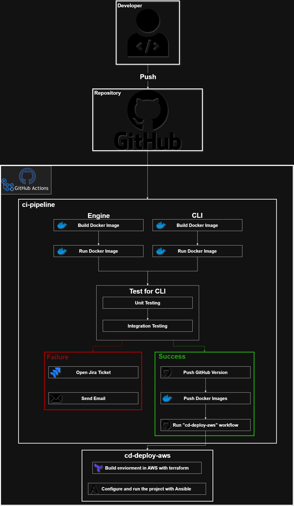
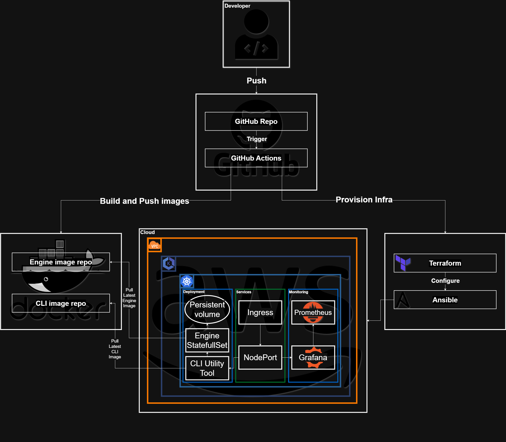

# SeyoAWE Community – Full DevOps Lifecycle & Automation Engine

## 🏗️ DevOps Architecture & Tech Stack

**Cloud Architecture:**


**CI/CD Architecture:**


**Deployment Workflow Architecture:**


| Area | Tool |
|---|---|
| Source control | GitHub |
| CI/CD orchestration | GitHub Actions |
| Containers & registry | Docker + Docker Hub |
| Infrastructure as Code | Terraform (AWS provider) |
| Configuration management | Ansible + Helm |
| Container orchestration | Kubernetes on AWS EKS (v1.33) |
| Cluster monitoring | Kubernetes Dashboard + metrics-server |

## 📂 Repository Structure

```text
.
├── Engine/                         # Automation engine runtime, modules, workflows
├── CLI/                            # sawectl source and platform binaries
├── docker/                         # Dockerfiles for Engine and CLI
├── helm/seyoawe-app/               # Helm chart: Engine StatefulSet + CLI Deployment
├── infrastructure/
│   ├── terraform/                  # VPC, EKS, IAM, OIDC, EBS CSI addon
│   └── ansible/deploy.yml          # Cluster-side install: StorageClass,
│                                   # metrics-server, Kubernetes Dashboard, app
├── .github/workflows/
│   ├── ci-pipeline.yml             # tests → build → push images
│   ├── cd-deploy-aws.yml           # terraform apply → ansible deploy
│   ├── cd-destroy-aws.yml          # cleanup → terraform destroy
│   └── sawectl.yml                 # run sawectl against the live Engine
├── scripts/
│   ├── open-dashboard.sh           # Free local access to the K8s Dashboard
│   └── sawectl.sh                  # Local wrapper for `sawectl` on the CLI pod
├── schemes/                        # Architecture diagrams
├── tests/                          # pytest suite (unit + integration + e2e)
└── task/                           # Planning notes
```

## 🚀 CI/CD Pipeline Flow

### CI — `ci-pipeline.yml` (on every push)

1. Boots the Engine + CLI via Docker Compose and runs `pytest` against it.
2. On failure, opens a Jira issue and sends a failure email (both optional — only fire if the matching secrets are set).
3. On pushes to the default branch that pass tests:
   - Computes the next semver tag (`v0.0.X`) from git history.
   - Creates and pushes the git tag.
   - Builds both Docker images and pushes them to Docker Hub tagged with `<version>`, `<commit-sha>`, and `latest`.

### CD — `cd-deploy-aws.yml` (manual, `workflow_dispatch`)

1. `terraform apply` builds/updates: VPC, public subnets, IGW, IAM roles, EKS control plane, managed node group (SPOT), OIDC provider, IRSA role for EBS CSI, and the `aws-ebs-csi-driver` addon.
2. Configures kubeconfig against the new cluster.
3. Runs `ansible-playbook infrastructure/ansible/deploy.yml` which installs:
   - The `gp3` StorageClass (default).
   - `metrics-server`.
   - `kubernetes-dashboard` (ClusterIP only) fronted by a password-protected nginx reverse proxy on a public Classic ELB.
   - An `admin-user` ServiceAccount + long-lived token Secret.
   - The `seyoawe-app` Helm release — the **Engine** `StatefulSet` (with probes, PVC, Service) **and** the **CLI** `Deployment` that runs alongside it with `SEYOAWE_ENGINE` pre-wired.
4. Writes a `dashboard-access.md` file with the Dashboard URL + basic-auth credentials (and the admin token as a fallback); the workflow appends it to the run summary and uploads it as a 1-day artifact.

### CD — `cd-destroy-aws.yml` (manual)

1. Deletes any `LoadBalancer` Services (otherwise AWS ELBs would leak).
2. Uninstalls the Helm release and deletes PVCs (otherwise EBS volumes would leak).
3. `terraform destroy` removes everything else.
All cleanup steps are best-effort — the workflow still works if the cluster is already gone.

### How this maps to the architecture diagrams

The three diagrams in `schemes/` are the reference architecture. The implementation matches them with three conscious deviations, all driven by free-tier AWS cost constraints or simplicity:

1. **CD is manual, not auto-triggered by CI** (`CICD_Arch.png` shows "success → Run cd-deploy-aws"). Auto-deploying on every green main-branch push would drain the $200 AWS credit quickly. CD is `workflow_dispatch` instead — you run it when you want a cluster, destroy it when you're done.
2. **`LoadBalancer` Service instead of `Ingress` + `NodePort`** (`Workflow_Arch.png`). Same role ("cluster traffic entry"); AWS Classic ELB + a Kubernetes Service is one fewer moving part than a separate Ingress controller deployment for a single app.
3. **Kubernetes Dashboard + `metrics-server` instead of Prometheus + Grafana** (`Workflow_Arch.png`). Much smaller RAM footprint — fits comfortably on `t3.small` SPOT nodes.

Everything else (Engine `StatefulSet` with PVC + probes, CLI utility `Deployment`, Docker Hub image repos, Terraform + Ansible provisioning from GitHub Actions) is implemented as drawn.

---

## ☁️ Running This on AWS — Step-by-Step

If you've never touched this repo before, this is the path from zero to a live cluster with the app running and the Dashboard open in your browser.

### 1. What you are about to deploy

- A single-VPC EKS cluster in two AZs (public subnets only — **no NAT Gateway**, to save cost).
- A managed node group of **2× t3.small SPOT** instances with the AL2023 AMI.
- The EBS CSI driver (for the Engine's 10 Gi persistent volume).
- `metrics-server` and the Kubernetes Dashboard (for monitoring).
- Your `seyoawe-app` Helm release in the `seyoawe` namespace — Engine `StatefulSet` + CLI `Deployment` running side-by-side, with the CLI pre-configured to reach the Engine Service.

### 2. One-time setup (do these once per fresh AWS account)

#### a. Create or pick an AWS account

A fresh account with the $200 free credit works. You'll be billed beyond that, so plan to **destroy the stack when you're not using it** (see §6).

#### b. Create an IAM user for GitHub Actions

1. IAM → Users → Create user → name it e.g. `github-actions-seyoawe`.
2. Attach permissions — for a demo account, `AdministratorAccess` is simplest. For tighter control, attach: `AmazonEC2FullAccess`, `AmazonVPCFullAccess`, `AmazonEKSClusterPolicy`, `IAMFullAccess`, `AmazonS3FullAccess`.
3. Security credentials → Create access key (use case: "Other"). Save the access key ID and secret — you'll paste them into GitHub secrets below.

#### c. Create the Terraform state S3 bucket

Terraform stores its state in S3 using native S3 state locking. The bucket name is configured in [`infrastructure/terraform/backend.tf`](./infrastructure/terraform/backend.tf) as `seyoawe-terraform-state-bucket-8520`. Either:

- Create that exact bucket in your AWS account, or
- Pick your own bucket name and update `backend.tf` before the first apply.

```bash
aws s3api create-bucket \
  --bucket <your-bucket-name> \
  --region <your-region> \
  --create-bucket-configuration LocationConstraint=<your-region>

aws s3api put-bucket-versioning \
  --bucket <your-bucket-name> \
  --versioning-configuration Status=Enabled
```

#### d. Create a Docker Hub account

Sign up at [hub.docker.com](https://hub.docker.com), then Account Settings → Personal access tokens → Generate. You'll use the token as `DOCKER_PASSWORD` below.

#### e. Add GitHub repo secrets and variables

In your repo → Settings → Secrets and variables → Actions:

**Variables** (tab "Variables"):

| Name | Example | Used by |
|---|---|---|
| `AWS_REGION` | `eu-west-1` | CD workflows |

**Secrets** (tab "Secrets"):

| Name | Value | Used by |
|---|---|---|
| `AWS_ACCESS_KEY_ID` | from step (b) | CD workflows |
| `AWS_SECRET_ACCESS_KEY` | from step (b) | CD workflows |
| `DOCKER_USERNAME` | your Docker Hub username | CI + CD (used as image namespace) |
| `DOCKER_PASSWORD` | Docker Hub access token from step (d) | CI |
| `DASHBOARD_ADMIN_PASSWORD` | a long random string you pick | CD — password for the public Dashboard URL (username is `admin`). **Required.** Use a strong one: the URL is reachable from anywhere. |
| `JIRA_BASE_URL`, `JIRA_USER_EMAIL`, `JIRA_API_TOKEN`, `JIRA_PROJECT_KEY` | *(optional — CI failure issues)* | CI |
| `EMAIL_USERNAME`, `EMAIL_PASSWORD`, `EMAIL_RECIPIENT` | *(optional — CI failure emails)* | CI |

### 3. Build the images (CI)

Push to the default branch (or merge a PR into it). The **CI Pipeline** workflow will:

1. Run tests.
2. If green, build `seyoawe-engine` and `seyoawe-cli` images and push them to Docker Hub under `${DOCKER_USERNAME}/seyoawe-engine:<tag>` and `seyoawe-cli:<tag>`.

Every successful main-branch build pushes three tags: the semver version, the commit SHA, and `latest`.

### 4. Deploy to AWS

1. GitHub → **Actions** → **CD - Deploy AWS** → **Run workflow**. Fill in:
   - `app_version`: `latest` (or a specific `vX.Y.Z` tag / commit SHA).

   That's it — no IP, no CIDR. Access is controlled by the `DASHBOARD_ADMIN_PASSWORD` secret you configured above.

2. Wait ~10–15 minutes on the first run (EKS control plane creation is slow). Subsequent updates only take 2–3 minutes.

3. When the run finishes, open its page and scroll to the **summary** at the bottom. You'll see:
   ```
   ## Kubernetes Dashboard access
   URL: https://<...>.elb.amazonaws.com
   Basic-auth username: admin
   Basic-auth password: the DASHBOARD_ADMIN_PASSWORD secret you set in GitHub.
   ```

4. Open the URL, accept the browser's self-signed cert warning, then enter `admin` + your password when the basic-auth dialog appears. You land directly in the Dashboard (the admin token is injected for you upstream).

### 5. Access options

**Option A — public URL (default):** Bookmark the workflow summary URL. The ELB hostname stays stable for the life of the cluster, so a single bookmark works for the whole session. If you need to change the password, update the secret and re-run the deploy — it rolls the proxy pod automatically.

**Option B — zero-cost local access:** if you'd rather not have a public ELB at all, skip the deploy workflow's proxy by port-forwarding the Dashboard's internal Kong service:

```bash
./scripts/open-dashboard.sh
```

It writes a kubeconfig, reads the admin token, copies it to your clipboard, and opens a port-forward at `https://localhost:8443`. Leave the script running. Ctrl-C to stop. (You still need the token for this path because the script bypasses the basic-auth proxy and hits the Dashboard's own login.)

Requirements: `aws` CLI configured, `kubectl` installed.

### 6. Running `sawectl` commands against the live Engine

The Helm release always deploys a `seyoawe-app-cli` pod **alongside** the Engine. It runs `sleep infinity` with `SEYOAWE_ENGINE` already wired to the Engine Service (`seyoawe-app-engine:8080`), so any `sawectl` invocation inside it talks to the right Engine with zero flags. Two convenient ways to use it:

**Option A — local helper script:**

```bash
# Once per shell (or export these in your profile):
export AWS_REGION=eu-west-1

./scripts/sawectl.sh list-modules
./scripts/sawectl.sh run --workflow /app/workflows/default/hello-world.yaml
./scripts/sawectl.sh --help
```

The script updates your kubeconfig, waits for the CLI pod to be ready, then `kubectl exec`s into it. Requires `aws` + `kubectl` locally.

**Option B — GitHub Actions workflow (no local tooling needed):**

GitHub → **Actions** → **Run sawectl** → **Run workflow**. Fill `args` with whatever you'd pass to `sawectl` on the command line (e.g. `list-modules` or `run --workflow /app/workflows/default/hello-world.yaml`). Output shows up in the run log.

This is handy for teammates who don't have kubectl configured, or for triggering workflows from your phone.

**Option C — raw kubectl:**

```bash
kubectl -n seyoawe exec -it deploy/seyoawe-app-cli -- sawectl list-modules
```

### 7. Destroy when you're done

This is the most important step for cost. EKS bills per hour whether you're using it or not.

GitHub → **Actions** → **CD - Destroy AWS** → **Run workflow**. It will:

1. Delete LoadBalancer Services (so AWS ELBs go away).
2. Uninstall the Helm release and delete PVCs (so EBS volumes go away).
3. `terraform destroy` — tears down the VPC, EKS, IAM, etc.

Run it every time you finish a session.

### 8. Expected cost

Rough figures for the default config. Destroying between sessions is what keeps the bill low.

| Component | Running 24/7 | Per 2-hour session |
|---|---|---|
| EKS control plane | ~$73/mo | ~$0.20 |
| 2× t3.small SPOT nodes | ~$10/mo | ~$0.03 |
| EBS gp3 (root + 10 Gi PVC) | ~$4/mo | ~$0.01 |
| Classic ELB for Dashboard *(Option A only)* | ~$18/mo | ~$0.05 |
| **Total** | **~$85–105/mo** | **~$0.30** |

A $200 credit lasts hundreds of test sessions if you destroy between uses. It runs out in ~2 months if you leave the cluster up.

### 9. Troubleshooting

| Symptom | Likely cause | Fix |
|---|---|---|
| `ImagePullBackOff` on engine pod | `DOCKER_USERNAME` secret mismatch with Docker Hub repo owner | Verify `DOCKER_USERNAME` matches the namespace your images were pushed under. |
| PVC stuck in `Pending` | EBS CSI driver didn't install | Rerun `terraform apply`; check `kubectl -n kube-system get pods -l app=ebs-csi-controller`. |
| `helm ... context deadline exceeded` | Pod not becoming Ready (image pull, PVC pending, readiness probe failing) | `kubectl -n seyoawe describe pod` and `kubectl -n seyoawe get events --sort-by=.lastTimestamp`. |
| Dashboard URL shows `401 Unauthorized` | Wrong password in the basic-auth dialog | Re-check `DASHBOARD_ADMIN_PASSWORD` in GitHub secrets and re-run Deploy; username is always `admin`. |
| Dashboard URL refuses to connect | ELB still provisioning, or was deleted | Wait ~2 min and retry; if still failing, re-run Deploy. Or use `scripts/open-dashboard.sh` for a local port-forward. |
| `terraform destroy` hangs on subnets/VPC | Dangling ELBs or ENIs from LoadBalancer Services | Re-run the destroy workflow — the pre-destroy cleanup handles it. Manual fallback: delete LBs in the AWS console, then re-run destroy. |
| Nodes "not connected" in AWS console | You're viewing EC2 instances, not the EKS **Compute** tab | Go to EKS → cluster → **Compute** to see registered nodes. |

## 🛠️ Local Development

You don't need AWS to hack on the app locally. From the repo root:

```bash
docker compose up -d --build
docker compose exec cli sawectl run \
  --workflow /app/workflows/default/hello-world.yaml \
  --server engine:8080
```

This runs the Engine on `http://localhost:8080` and gives you an idle CLI container to exec into. See the original project documentation below for how to write workflows.

<br>

---
---

# ⬇️ ORIGINAL SEYOAWE PROJECT DOCUMENTATION ⬇️
*Note: The following section is the original, unmodified documentation from the base SeyoAWE repository.*

---
---

<br>

# ⚙️ SeyoAWE — Universal Workflow Automation Engine

**Version:** 1.0  
**Author:** Yuri Bernstein  
**License:** Dual (Community Edition | Commercial Edition)  
**Website:** [seyoawe.dev](https://seyoawe.dev) *(Coming soon)*

---

## 🚀 What is SeyoAWE?

**SeyoAWE** is a modular, GitOps-native, human-in-the-loop automation platform.  
Define powerful, reliable workflows in YAML — with built-in support for approvals, forms, Git, APIs, Slack, and more.

### 🔥 What Makes SeyoAWE Different

- **Modular by Design**: Each Python module is a clear, composable unit.
- **GitOps-Native**: Treat workflows as code. Push to Git. Trigger via webhook or poll.
- **Human-in-the-Loop**: Slack approvals, webforms, dynamic approval links, and chatbot interactions built-in.
- **Crash-Resilient**: Persistent state, resumable runs, and detailed logs.
- **Pluggable**: Add your own modules in minutes. APIs, scripts, workflows, or UIs.

---

## 📦 Quickstart

### ✅ Requirements

`eninge`: none

`sawectl`:
  `binary`: none
  `python script`:
    - Python 3.10+


### 🚀 Running SeyoAWE (Local Engine)

```bash
./Engine/run.sh linux   # or ./Engine/run.sh macos
```

This launches the Flask-powered SeyoAWE runtime at `http://localhost:8080`.

Your `Engine/configuration/config.yaml` should point to:
```yaml
directories:
  workdir: /path/to/seyoawe-execution-plane
  modules: /path/to/seyoawe/modules
  workflows: /path/to/seyoawe/workflows
```

---

## 🧬 Writing Your First Workflow

```bash
sawectl init workflow hello-world
```

Creates a scaffold in `Engine/workflows/hello-world.yaml`.

### 🧾 Example Workflow

```yaml
name: hello-world
trigger:
  type: ad-hoc

context_variables:
  name: "Yura"

steps:
  - id: greet
    module: slack
    config:
      message: "Hello, {{ context.name }}! Welcome to SeyoAWE."
```

### 💡 Run it

```bash
sawectl run --workflow Engine/workflows/default/hello-world.yaml --server localhost:8080
```

---

## 🧰 sawectl CLI

The official CLI tool to manage, validate, and run workflows.

### 🔑 Common Commands

```bash
sawectl run <path.yaml>             # Run ad-hoc workflow
sawectl validate-workflow <wf.yaml> # Deep schema + module validation
sawectl list-modules                # View installed modules
sawectl init workflow <name>        # Scaffold a new workflow
sawectl init module <name>          # Scaffold a custom module
```

---

## ⏰ Trigger System

| Trigger      | Description                                                            |
| ------------ | -----------------------------------------------------------------------|
| `api`        | Exposes an endpoint to receive and parse events                        |
| `git`        | Monitors Git repos (poll or webhook) for file changes                  |
| `scheduled`  | Uses cron syntax with for recurring workflows                          |
| `ad-hoc`     | Manually executed via CLI or UI                                        |

---

## 🧩 Modules

Modules are plug-and-play Python classes with full control.

### 📦 Built-In Modules

| Module     | Description                                         |
|------------|-----------------------------------------------------|
| `webform`  | React-based approval form renderer                  |
| `slack`    | Sends messages and links via Slack                  |
| `email`    | Sends rich email notifications or approval requests |
| `api`      | Makes dynamic REST API calls                        |
| `git`      | GitOps actions: branches, commits, PRs              |
| `chatbot`  | Interacts with users using LLMs (OpenAI, Mistral)   |

---

### 🧑‍🔧 Build Your Own Module

```bash
sawectl module create mymodule
```

Creates:
```plaintext
modules/mymodule/
  ├── module.yaml
  └── mymodule.py
```

Edit `module.yaml`:
```yaml
name: mymodule
entrypoint: mymodule.py
description: My custom module
```

Edit `mymodule.py`:
```python
class Module:
    def execute(self, input_data, context, **kwargs):
        # do something here
        return {'status': 'ok', 'message': 'Success'}
```

Modules return:
- `ok` → step succeeded
- `fail` → halts workflow
- `warn` → logs warning, proceeds

---

## 🧾 Webforms & Approvals

Any step can pause for human approval:

```yaml
approval: true
delivery_step:
  module: slack
  config:
    message: "Please approve: {{ context.approval_link }}"
```

You can also define rich webforms with structured input. The engine waits, collects the form data, and resumes with `context.form_data`.

---

## 🧠 Workflow Context

The engine maintains a context object across steps.

- Use `context` to inject dynamic values
- Update context between steps
- Access previous results via `context.step_id.output`

---

## 🐞 Logs & Recovery

Each run generates:

- A UUID
- A lifetime state JSON file
- A full per-run log

```bash
lifetimes/3f21fa2b-...json
logs/run_3f21fa2b-...log
```

Crash? Restart the engine — it will resume in-place.

---

## 🎯 Real-World Use Cases

✅ CI/CD with approvals  
✅ Slack & email alerting  
✅ Integration with any system or tool using generic `api` and `command` modules
✅ GitOps PR automation  
✅ Multi-step integrations with manual gates

Involve human review(s) at any stage !
---

## 📜 License

SeyoAWE is dual-licensed:

| Edition            | License       | Details                                                |
|--------------------|---------------|--------------------------------------------------------|
| **Community** | Custom        | Free to use internally. No resale or monetization.     |
| **Commercial** | Proprietary   | Adds DB, secrets, premium modules, premium support,    |
|                    |               | dashboards and reports and more.                       |

See [`LICENSE`](./LICENSE) for full details.

---

## 🙋 Get Involved

- 💡 Want to contribute a module? PR to `modules/`
- 🧪 Testing a module in a large org? Reach out for early access!
- 🧰 Using in a CI/CD pipeline? Tell us how it helped!

---

## 🏁 Final Word

SeyoAWE isn’t just another automation engine.

It’s a human-aware, Git-native, modular platform for teams who need infinitley flexible, yet simple automation solution

---
